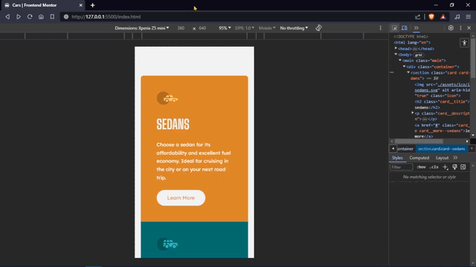
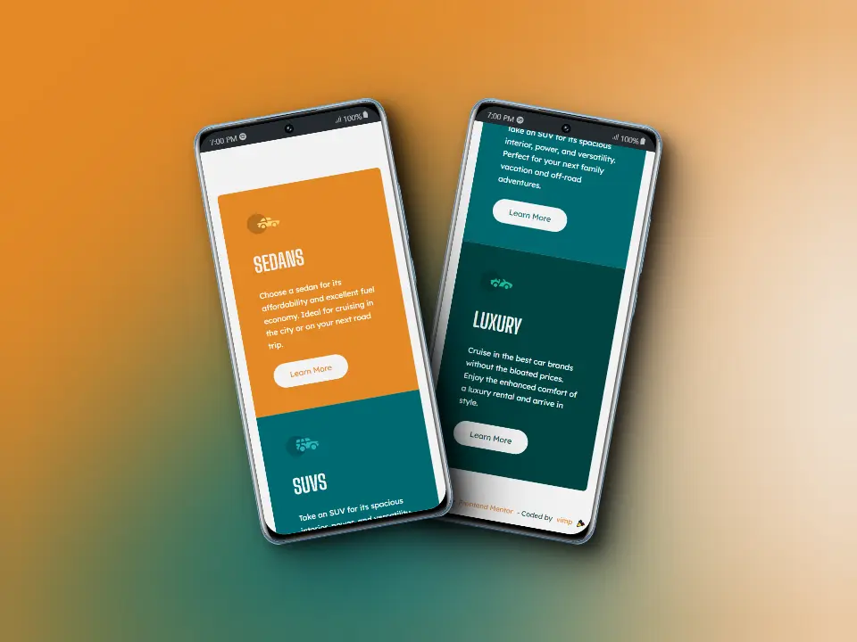
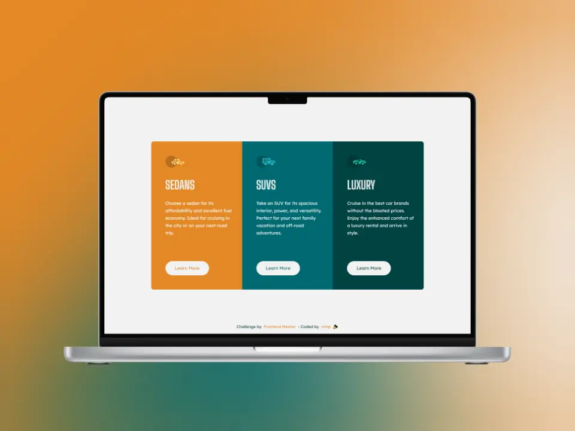

# Frontend Mentor - 3-column preview card component solution

This is a solution to the [3-column preview card component challenge on Frontend Mentor](https://www.frontendmentor.io/challenges/3column-preview-card-component-pH92eAR2-). 

Frontend Mentor challenges help you improve your coding skills by building realistic projects.

## Table of contents

📌 [The challenge](#the-challenge)

📌 [Screenshot](#screenshot)

📌 [Links](#links)

📌 [Built with](#built-with)

📌 [Useful resources](#useful-resources)

📌 [Author](#author)

### The challenge

Users should be able to:

🎯 View the optimal layout depending on their device's screen size

🎯 See hover states for interactive elements

## Screenshot

### 📱 Mobile

### 💻 Desktop

## Links

[Live Site](https://mendez-v.github.io/3-column-preview-card/) 👀

[Solution in Frontend Mentor](https://www.frontendmentor.io/solutions/3column-preview-card-component-using-grid-and-flex-TIr7mUZ6Iz) 👀

[Challenge repository](https://github.com/mendez-v/frontend-mentor-challenges) 👀

## Built with

✅ Semantic HTML5 markup

✅ CSS custom properties

✅ Flexbox

✅ CSS Grid

✅ Mobile-first workflow

### Useful resources

🖼 Favicon - [Car](https://iconscout.com/icons/car) by [Elegant Themes](https://iconscout.com/contributors/elegant-themes)

## Author

✨ Frontend Mentor - [@mendez-v](https://www.frontendmentor.io/profile/mendez-v)

